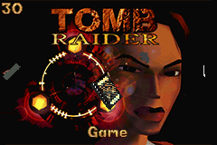

# Autogenerated Compatibility

This file contains a table with all ROMS tested along with some details parsed from the ROM and a screenshot from 100 frames in with no button presses

<table>
  <thead>
    <tr>
<td>Filename</td><td>Game Title</td><td>Bootable</td><td>Save Type</td><td>Image</td><td>FPS</td>    </tr>
  </thead>
  <tbody>
<tr><td>Advance Wars 2 - Black Hole Rising (USA, Australia)</td><td>ADVANCEWARS</td><td>:heavy_check_mark:</td><td>FLASH64</td><td></img></td><td>100.28</tr>
<tr><td>Advanced Wars</td><td>ADVANCEWARS</td><td>:heavy_check_mark:</td><td>FLASH64</td><td></img></td><td>122.16</tr>
<tr><td>Aero the Acrobat - Rascal Rival Revenge</td><td>AEROACROBAT</td><td>:heavy_check_mark:</td><td>EEPROM</td><td></img></td><td>131.72</tr>
<tr><td>Alien Hominid</td><td>ALIENHOMINI</td><td>:heavy_check_mark:</td><td>EEPROM</td><td></img></td><td>252.78</tr>
<tr><td>Astro Boy - Omega Factor</td><td>ASTRO BOY-O</td><td>:heavy_check_mark:</td><td>EEPROM</td><td></img></td><td>214.41</tr>
<tr><td>Atari Anniversary Advance (USA)</td><td>ATARI_ANNIV</td><td>:heavy_check_mark:</td><td>SRAM</td><td></img></td><td>186.15</tr>
<tr><td>Banjo Kazooie - Grunty_s Revenge</td><td>BANJOKAZOOI</td><td>:heavy_check_mark:</td><td>EEPROM</td><td></img></td><td>138.24</tr>
<tr><td>Banjo Pilot</td><td>BANJO PILOT</td><td>:heavy_check_mark:</td><td>EEPROM</td><td></img></td><td>128.07</tr>
<tr><td>Bomber-Man Tournament</td><td>BOMSTORYUSA</td><td>:heavy_check_mark:</td><td>SRAM</td><td></img></td><td>127.03</tr>
<tr><td>Bomberman Max 2 - Blue (E)</td><td>BOMBERMAN M</td><td>:heavy_check_mark:</td><td>EEPROM</td><td></img></td><td>100.97</tr>
<tr><td>Bomberman Max 2 - Red (E)</td><td>BMAX2-RED</td><td>:heavy_check_mark:</td><td>EEPROM</td><td></img></td><td>104.34</tr>
<tr><td>Breath of Fire (E)</td><td>BOF EUR</td><td>:heavy_check_mark:</td><td>SRAM</td><td></img></td><td>266.24</tr>
<tr><td>Breath of Fire II (USA)</td><td>BOF2</td><td>:heavy_check_mark:</td><td>SRAM</td><td></img></td><td>146.03</tr>
<tr><td>Broken Sword - the Shadow of the Templars</td><td>BROKENSWORD</td><td>:heavy_check_mark:</td><td>EEPROM</td><td></img></td><td>127.06</tr>
<tr><td>Car Battler Joe (USA)</td><td>CARBATTLERJ</td><td>:heavy_check_mark:</td><td>EEPROM</td><td></img></td><td>114.36</tr>
<tr><td>Castlevania - Aria of Sorrow (USA)</td><td>CASTLEVANIA</td><td>:heavy_check_mark:</td><td>SRAM</td><td></img></td><td>164.64</tr>
<tr><td>Castlevania - Circle of the Moon</td><td>DRACULA AGB</td><td>:heavy_check_mark:</td><td>SRAM</td><td></img></td><td>128.11</tr>
<tr><td>Castlevania - Harmony Of Dissonance</td><td>CASTLEVANIA</td><td>:heavy_check_mark:</td><td>SRAM</td><td></img></td><td>255.23</tr>
<tr><td>Chu Chu Rocket!</td><td>CHUCHUROCKE</td><td>:heavy_check_mark:</td><td>FLASH64</td><td></img></td><td>125.79</tr>
<tr><td>Crash Bandicoot - Purple Riptos Rampage</td><td>CRASH PURPL</td><td>:heavy_check_mark:</td><td>EEPROM</td><td></img></td><td>171.41</tr>
<tr><td>Crash Bandicoot - the Huge Adventure</td><td>CRASH</td><td>:heavy_check_mark:</td><td>EEPROM</td><td></img></td><td>236.07</tr>
<tr><td>Crash Bandicoot 2 - N-Tranced</td><td>CRASH2</td><td>:heavy_check_mark:</td><td>EEPROM</td><td></img></td><td>228.94</tr>
<tr><td>Denki Blocks! (USA) (En,Es)</td><td>DENKIBLOCKS</td><td>:heavy_check_mark:</td><td>EEPROM</td><td></img></td><td>123.98</tr>
<tr><td>Densetsu no Stafy 2</td><td>STAFY 2</td><td>:heavy_check_mark:</td><td>SRAM</td><td></img></td><td>262.74</tr>
<tr><td>Densetsu no Stafy 3</td><td>STAFY 3</td><td>:heavy_check_mark:</td><td>SRAM</td><td></img></td><td>207.04</tr>
<tr><td>Densetsu no Stafy</td><td>STAFY</td><td>:heavy_check_mark:</td><td>SRAM</td><td></img></td><td>226.76</tr>
<tr><td>Disney_s Kim Possible 2 - Drakken_s Demise (U)</td><td>KIMPOSSIBLE</td><td>:heavy_check_mark:</td><td>EEPROM</td><td></img></td><td>184.16</tr>
<tr><td>Donkey Kong - King of Swing</td><td>KINGOFSWING</td><td>:heavy_check_mark:</td><td>SRAM</td><td></img></td><td>171.88</tr>
<tr><td>Donkey Kong Country 2 (U)</td><td>RAREDKC2</td><td>:heavy_check_mark:</td><td>EEPROM</td><td></img></td><td>134.77</tr>
<tr><td>Donkey Kong Country 3</td><td>RAREDKC3</td><td>:heavy_check_mark:</td><td>EEPROM</td><td></img></td><td>148.37</tr>
<tr><td>Donkey Kong Country</td><td>RAREDKC1</td><td>:heavy_check_mark:</td><td>EEPROM</td><td></img></td><td>184.50</tr>
<tr><td>Doom (USA, Europe)</td><td>AGB-DOOM</td><td>:heavy_check_mark:</td><td>EEPROM</td><td></img></td><td>184.64</tr>
<tr><td>Dr. Mario _ Puzzle League</td><td>DRMARIO&PON</td><td>:heavy_check_mark:</td><td>EEPROM</td><td></img></td><td>251.51</tr>
<tr><td>Drill Dozer</td><td>DRILL DOZER</td><td>:heavy_check_mark:</td><td>SRAM</td><td></img></td><td>251.64</tr>
<tr><td>Duke Nukem Advance (U)</td><td>DUKE NUKEM </td><td>:heavy_check_mark:</td><td>EEPROM</td><td></img></td><td>200.80</tr>
<tr><td>Ecks vs. Sever (E)</td><td>ECKS VSE SE</td><td>:heavy_check_mark:</td><td>SRAM</td><td></img></td><td>242.13</tr>
<tr><td>F-Zero - Maximum Velocity (USA, Europe)</td><td>F-ZERO ADVA</td><td>:heavy_check_mark:</td><td>SRAM</td><td></img></td><td>127.65</tr>
<tr><td>F-Zero 2 - GP Legend</td><td>F-ZERO2</td><td>:heavy_check_mark:</td><td>SRAM</td><td></img></td><td>127.19</tr>
<tr><td>Final Fantasy - Tactics Advanced</td><td>FFTA_USVER.</td><td>:heavy_check_mark:</td><td>FLASH64</td><td></img></td><td>111.56</tr>
<tr><td>Final Fantasy 1 + 2 - Dawn of Souls</td><td>FF1&2DAWNOF</td><td>:heavy_check_mark:</td><td>SRAM</td><td></img></td><td>243.07</tr>
<tr><td>Final Fantasy 4 Advance</td><td>FF4ADVANCE</td><td>:heavy_check_mark:</td><td>SRAM</td><td></img></td><td>287.19</tr>
<tr><td>Final Fantasy 5 Advance</td><td>FF5ADVANCE</td><td>:heavy_check_mark:</td><td>SRAM</td><td></img></td><td>242.25</tr>
<tr><td>Final Fantasy 6 Advance</td><td>FF6ADVANCE</td><td>:heavy_check_mark:</td><td>SRAM</td><td></img></td><td>222.42</tr>
<tr><td>Final Fight One (U)</td><td>FINAL FIGHT</td><td>:heavy_check_mark:</td><td>EEPROM</td><td></img></td><td>118.79</tr>
<tr><td>Fire Emblem - the Sacred Stones</td><td>FIREEMBLEM2</td><td>:heavy_check_mark:</td><td>SRAM</td><td></img></td><td>239.01</tr>
<tr><td>Fire Emblem</td><td>FIREEMBLEME</td><td>:heavy_check_mark:</td><td>SRAM</td><td></img></td><td>167.95</tr>
<tr><td>Frogger_s Adventure - Temple of the Frog</td><td>FROG: TEMPL</td><td>:heavy_check_mark:</td><td>EEPROM</td><td></img></td><td>109.05</tr>
<tr><td>Frogger_s Adventures 2 - The Lost Wand (E)</td><td>FG2 THE LOS</td><td>:heavy_check_mark:</td><td>EEPROM</td><td></img></td><td>216.45</tr>
<tr><td>Game _ Watch Gallery Advance</td><td>G&W GALLERY</td><td>:heavy_check_mark:</td><td>SRAM</td><td></img></td><td>150.24</tr>
<tr><td>Golden Sun - The Lost Age (USA, Europe)</td><td>GOLDEN_SUN_</td><td>:heavy_check_mark:</td><td>FLASH64</td><td></img></td><td>96.19</tr>
<tr><td>Golden Sun</td><td>Golden_Sun_</td><td>:heavy_check_mark:</td><td>FLASH64</td><td></img></td><td>233.10</tr>
<tr><td>Gradius Galaxies (USA)</td><td>GRADIUSGALA</td><td>:heavy_check_mark:</td><td>EEPROM</td><td></img></td><td>129.50</tr>
<tr><td>Grand Theft Auto Advance</td><td>GTA</td><td>:heavy_check_mark:</td><td>EEPROM</td><td></img></td><td>159.69</tr>
<tr><td>Gunstar Super Heroes</td><td>GUNSTAR SH</td><td>:heavy_check_mark:</td><td>EEPROM</td><td></img></td><td>131.96</tr>
<tr><td>Hamtaro - Ham-Ham Games (Europe) (En,Fr,De,Es,It)</td><td>HAMSPORTS</td><td>:heavy_check_mark:</td><td>SRAM</td><td></img></td><td>158.88</tr>
<tr><td>Harvest Moon - Friends of Mineral Town</td><td>HARVESTMOGB</td><td>:heavy_check_mark:</td><td>SRAM</td><td></img></td><td>268.24</tr>
<tr><td>Harvest Moon - More Friends of Mineral Town (U)</td><td>HM MFOM USA</td><td>:heavy_check_mark:</td><td>SRAM</td><td></img></td><td>266.24</tr>
<tr><td>Karnaaj Rally (U)</td><td>KARNAAJ</td><td>:heavy_check_mark:</td><td>FLASH64</td><td></img></td><td>137.21</tr>
<tr><td>King of Fighters EX 2 - Howling Blood</td><td>KOFEX2HOWLI</td><td>:heavy_check_mark:</td><td>EEPROM</td><td></img></td><td>215.80</tr>
<tr><td>King of Fighters EX, The - NeoBlood (U) (V1.1)</td><td>KINGOFEXNEO</td><td>:heavy_check_mark:</td><td>EEPROM</td><td></img></td><td>111.81</tr>
<tr><td>Kingdom Hearts - Chain of Memories</td><td>KINGDOMHEAR</td><td>:heavy_check_mark:</td><td>SRAM</td><td></img></td><td>167.45</tr>
<tr><td>Kirby & The Amazing Mirror (USA)</td><td>AGB KIRBY A</td><td>:heavy_check_mark:</td><td>SRAM</td><td></img></td><td>111.93</tr>
<tr><td>Kirby - Nightmare in Dream Land (USA)</td><td>AGB KIRBY D</td><td>:heavy_check_mark:</td><td>SRAM</td><td></img></td><td>152.11</tr>
<tr><td>Klonoa - Empire of Dreams</td><td>KLONOA EMPI</td><td>:heavy_check_mark:</td><td>EEPROM</td><td></img></td><td>241.66</tr>
<tr><td>Klonoa 2 - Dream Champ Tournament</td><td>KLONOA2</td><td>:heavy_check_mark:</td><td>EEPROM</td><td></img></td><td>225.73</tr>
<tr><td>Konami Krazy Racers (Europe)</td><td>KRAZY RACER</td><td>:heavy_check_mark:</td><td>SRAM</td><td></img></td><td>118.29</tr>
<tr><td>Kuru Kuru Kururin</td><td>KURURIN</td><td>:heavy_check_mark:</td><td>SRAM</td><td></img></td><td>125.09</tr>
<tr><td>Kururin Paradise (Japan)</td><td>KURUPARA</td><td>:heavy_check_mark:</td><td>SRAM</td><td></img></td><td>199.52</tr>
<tr><td>Legend of Zelda, The - A Link to the Past _ Four Swords (USA, Australia)</td><td>GBAZELDA</td><td>:heavy_check_mark:</td><td>EEPROM</td><td></img></td><td>258.13</tr>
<tr><td>LEGO - Star Wars - the Video Game</td><td>LEGOSTARWAR</td><td>:heavy_check_mark:</td><td>EEPROM</td><td></img></td><td>183.08</tr>
<tr><td>LEGO - Star Wars 2 - the Original Trilogy</td><td>LSW2GBA</td><td>:heavy_check_mark:</td><td>EEPROM</td><td></img></td><td>100.89</tr>
<tr><td>Lilo _ Stitch</td><td>LILO AND ST</td><td>:heavy_check_mark:</td><td>SRAM</td><td></img></td><td>115.98</tr>
<tr><td>Lord of the Rings 2 - the Two Towers</td><td>TWO TOWERS</td><td>:heavy_check_mark:</td><td>EEPROM</td><td></img></td><td>121.27</tr>
<tr><td>Lord of the Rings 3 - Return of the King</td><td>RETURN KING</td><td>:heavy_check_mark:</td><td>EEPROM</td><td></img></td><td>108.58</tr>
<tr><td>Lunar Legend (U) [!]</td><td>LUNAR LEGEN</td><td>:heavy_check_mark:</td><td>EEPROM</td><td></img></td><td>197.16</tr>
<tr><td>Mario Advanced - Mario Bros. 2 + Mario Classic</td><td>SUPER MARIO</td><td>:heavy_check_mark:</td><td>EEPROM</td><td></img></td><td>97.79</tr>
<tr><td>Mario Advanced 2 - Mario World</td><td>SUPER MARIO</td><td>:heavy_check_mark:</td><td>EEPROM</td><td></img></td><td>96.60</tr>
<tr><td>Mario Advanced 4 - Mario Bros. 3</td><td>SUPER MARIO</td><td>:heavy_check_mark:</td><td>FLASH128</td><td></img></td><td>101.36</tr>
<tr><td>Mario and Luigi - Superstar Saga</td><td>MARIO&LUIGI</td><td>:heavy_check_mark:</td><td>EEPROM</td><td></img></td><td>164.31</tr>
<tr><td>Mario Golf - Advance Tour</td><td>MARIOGOLFGB</td><td>:heavy_check_mark:</td><td>SRAM</td><td></img></td><td>135.39</tr>
<tr><td>Mario Kart - Super Circuit</td><td>MARIO KART</td><td>:heavy_check_mark:</td><td>FLASH64</td><td></img></td><td>206.02</tr>
<tr><td>Mario Tennis - Power Tour</td><td>MARIOTENNIS</td><td>:heavy_check_mark:</td><td>SRAM</td><td></img></td><td>136.39</tr>
<tr><td>Mario vs. Donkey Kong</td><td>MARIOVSDK</td><td>:heavy_check_mark:</td><td>FLASH64</td><td></img></td><td>188.75</tr>
<tr><td>Max Payne (USA)</td><td>MAX PAYNE  </td><td>:heavy_check_mark:</td><td>EEPROM</td><td></img></td><td>173.97</tr>
<tr><td>Medal of Honor - Infiltrator (U)</td><td>INFILTRATOR</td><td>:heavy_check_mark:</td><td>EEPROM</td><td></img></td><td>141.16</tr>
<tr><td>Mega-Man - Zero 2</td><td>MEGAMANZERO</td><td>:heavy_check_mark:</td><td>SRAM</td><td></img></td><td>130.62</tr>
<tr><td>Mega-Man - Zero 3</td><td>MEGAMANZERO</td><td>:heavy_check_mark:</td><td>SRAM</td><td></img></td><td>123.76</tr>
<tr><td>Mega-Man - Zero 4</td><td>MEGAMANZERO</td><td>:heavy_check_mark:</td><td>EEPROM</td><td></img></td><td>133.80</tr>
<tr><td>Mega-Man and Bass</td><td>MEGAMAN&BAS</td><td>:heavy_check_mark:</td><td>EEPROM</td><td></img></td><td>141.40</tr>
<tr><td>Mega-Man Battle Network 2</td><td>MEGAMAN_EXE</td><td>:heavy_check_mark:</td><td>SRAM</td><td></img></td><td>87.03</tr>
<tr><td>Mega-Man Battle Network 3 - Blue</td><td>MEGA_EXE3_B</td><td>:heavy_check_mark:</td><td>SRAM</td><td></img></td><td>125.34</tr>
<tr><td>Mega-Man Battle Network 3 - White</td><td>MEGA_EXE3_W</td><td>:heavy_check_mark:</td><td>SRAM</td><td></img></td><td>132.28</tr>
<tr><td>Mega-Man Battle Network 4 - Blue Moon</td><td>MEGAMANBN4B</td><td>:heavy_check_mark:</td><td>SRAM</td><td></img></td><td>110.62</tr>
<tr><td>Mega-Man Battle Network 4 - Red Sun</td><td>MEGAMANBN4R</td><td>:heavy_check_mark:</td><td>SRAM</td><td></img></td><td>112.46</tr>
<tr><td>Mega-Man Battle Network 5 - Team Colonel</td><td>MEGAMAN5_TC</td><td>:heavy_check_mark:</td><td>SRAM</td><td></img></td><td>119.22</tr>
<tr><td>Mega-Man Battle Network 5 - Team Proto-Man</td><td>MEGAMAN5_TP</td><td>:heavy_check_mark:</td><td>SRAM</td><td></img></td><td>96.62</tr>
<tr><td>Mega-Man Battle Network 6 - Cybeast Falzar</td><td>MEGAMAN6_FX</td><td>:heavy_check_mark:</td><td>SRAM</td><td></img></td><td>94.91</tr>
<tr><td>Mega-Man Battle Network 6 - Cybeast Gregar</td><td>MEGAMAN6_GX</td><td>:heavy_check_mark:</td><td>SRAM</td><td></img></td><td>93.90</tr>
<tr><td>Mega-Man Battle Network</td><td>MEGAMAN_BN</td><td>:heavy_check_mark:</td><td>SRAM</td><td></img></td><td>93.08</tr>
<tr><td>Megaman Zero (USA, Europe)</td><td>MEGAMAN ZER</td><td>:heavy_check_mark:</td><td>SRAM</td><td></img></td><td>121.21</tr>
<tr><td>Metal Slug Advance</td><td>METAL SLUG</td><td>:heavy_check_mark:</td><td>EEPROM</td><td></img></td><td>130.58</tr>
<tr><td>Metroid - Fusion</td><td>METROID4USA</td><td>:heavy_check_mark:</td><td>SRAM</td><td></img></td><td>157.88</tr>
<tr><td>Metroid - Zero Mission</td><td>ZEROMISSION</td><td>:heavy_check_mark:</td><td>SRAM</td><td></img></td><td>224.92</tr>
<tr><td>Monkey Ball Jr.</td><td>MONKEYBALLJ</td><td>:heavy_check_mark:</td><td>EEPROM</td><td></img></td><td>143.31</tr>
<tr><td>Monster Rancher Advance (USA)</td><td>MONSRANCHER</td><td>:heavy_check_mark:</td><td>SRAM</td><td></img></td><td>103.48</tr>
<tr><td>Monster Rancher Advance 2 (USA)</td><td>MONSTERRANC</td><td>:heavy_check_mark:</td><td>SRAM</td><td></img></td><td>102.67</tr>
<tr><td>Mortal Kombat - Deadly Alliance (USA) (En,Fr,De,Es,It)</td><td>MKALLIANCE</td><td>:heavy_check_mark:</td><td>EEPROM</td><td></img></td><td>109.82</tr>
<tr><td>Mother 3 (J) [T+Eng]</td><td>MOTHER3</td><td>:heavy_check_mark:</td><td>FLASH64</td><td></img></td><td>158.23</tr>
<tr><td>Ninja Cop</td><td>NINJA COP  </td><td>:heavy_check_mark:</td><td>EEPROM</td><td></img></td><td>269.11</tr>
<tr><td>OpenLara</td><td>OpenLara</td><td>:heavy_check_mark:</td><td>SRAM</td><td></img></td><td>126.52</tr>
<tr><td>Pac-Man Collection</td><td>PACMANCOLLE</td><td>:heavy_check_mark:</td><td>SRAM</td><td></img></td><td>261.23</tr>
<tr><td>Pocky _ Rocky with Becky</td><td>POCKY-ROCKY</td><td>:heavy_check_mark:</td><td>SRAM</td><td></img></td><td>244.50</tr>
<tr><td>Pokemon - Emerald Version (USA, Europe)</td><td>POKEMON EME</td><td>:heavy_check_mark:</td><td>FLASH128</td><td></img></td><td>94.63</tr>
<tr><td>Pokemon - Fire Red</td><td>POKEMON FIR</td><td>:heavy_check_mark:</td><td>FLASH128</td><td></img></td><td>96.90</tr>
<tr><td>Pokemon - Leaf Green Version (USA)</td><td>POKEMON LEA</td><td>:heavy_check_mark:</td><td>FLASH128</td><td></img></td><td>96.32</tr>
<tr><td>Pokemon - Ruby Version (USA)</td><td>POKEMON RUB</td><td>:heavy_check_mark:</td><td>FLASH128</td><td></img></td><td>174.40</tr>
<tr><td>Pokemon - Sapphire Version (USA)</td><td>POKEMON SAP</td><td>:heavy_check_mark:</td><td>FLASH128</td><td></img></td><td>168.18</tr>
<tr><td>Pokemon Mystery Dungeon - Red Rescue Team</td><td>POKE DUNGEO</td><td>:heavy_check_mark:</td><td>FLASH128</td><td></img></td><td>120.28</tr>
<tr><td>Pokemon Pinball - Ruby _ Sapphire (E)</td><td>POKEPIN R/S</td><td>:heavy_check_mark:</td><td>SRAM</td><td></img></td><td>223.71</tr>
<tr><td>Puyo Pop</td><td>PUYO POP</td><td>:heavy_check_mark:</td><td>EEPROM</td><td></img></td><td>175.93</tr>
<tr><td>Puzzle Fighter 2 Turbo</td><td>PUZZLEFIGHT</td><td>:heavy_check_mark:</td><td>EEPROM</td><td></img></td><td>146.07</tr>
<tr><td>Racing Gears Advance (U)</td><td>RACING GEAR</td><td>:heavy_check_mark:</td><td>EEPROM</td><td></img></td><td>235.85</tr>
<tr><td>Ray-Man 3 - Hoodlum Havoc</td><td>RAYMAN 3</td><td>:heavy_check_mark:</td><td>EEPROM</td><td></img></td><td>168.52</tr>
<tr><td>Ray-Man Advance</td><td>RAYMAN</td><td>:heavy_check_mark:</td><td>EEPROM</td><td></img></td><td>123.61</tr>
<tr><td>Rhythm Tengoku (Japan)</td><td>RHYTHMTENGO</td><td>:heavy_check_mark:</td><td>SRAM</td><td></img></td><td>112.11</tr>
<tr><td>Riviera - The Promised Land (U)</td><td>RIVIERA</td><td>:heavy_check_mark:</td><td>SRAM</td><td></img></td><td>129.74</tr>
<tr><td>Sonic Advance 2</td><td>SONIC ADVAN</td><td>:heavy_check_mark:</td><td>FLASH64</td><td></img></td><td>148.37</tr>
<tr><td>Sonic Advance 3 (USA) (En,Ja,Fr,De,Es,It)</td><td>SONICADVANC</td><td>:heavy_check_mark:</td><td>FLASH64</td><td></img></td><td>198.89</tr>
<tr><td>Sonic Advance</td><td>SONICADVANC</td><td>:heavy_check_mark:</td><td>FLASH64</td><td></img></td><td>187.62</tr>
<tr><td>Sonic Battle</td><td>SONICBATTLE</td><td>:heavy_check_mark:</td><td>FLASH64</td><td></img></td><td>182.68</tr>
<tr><td>Sonic Pinball Party (USA) (En,Ja,Fr,De,Es,It)</td><td>SONICPINBAL</td><td>:heavy_check_mark:</td><td>FLASH64</td><td></img></td><td>147.19</tr>
<tr><td>Spider-Man - Mysterio_s Menace (U) [!]</td><td>SPIDERMAN M</td><td>:heavy_check_mark:</td><td>SRAM</td><td></img></td><td>244.26</tr>
<tr><td>Spyro - Season of Ice</td><td>SPYRO</td><td>:heavy_check_mark:</td><td>EEPROM</td><td></img></td><td>249.25</tr>
<tr><td>Spyro 2 - Season of Flame</td><td>SPYRO 2</td><td>:heavy_check_mark:</td><td>EEPROM</td><td></img></td><td>132.52</tr>
<tr><td>Spyro 3 - Attack of the Rhynocs</td><td>SPYRO 3</td><td>:heavy_check_mark:</td><td>EEPROM</td><td></img></td><td>256.67</tr>
<tr><td>Spyro Orange - the Cortex Conspiracy</td><td>SPYRO ORANG</td><td>:heavy_check_mark:</td><td>EEPROM</td><td></img></td><td>194.70</tr>
<tr><td>Street Fighter Alpha 3 (E) [!]</td><td>STREET FIGH</td><td>:heavy_check_mark:</td><td>EEPROM</td><td></img></td><td>182.22</tr>
<tr><td>Summon Night - Swordcraft Story 2</td><td>SWORDCRAFT2</td><td>:heavy_check_mark:</td><td>EEPROM</td><td></img></td><td>242.84</tr>
<tr><td>Summon Night - Swordcraft Story</td><td>SUMMONIGHSC</td><td>:heavy_check_mark:</td><td>EEPROM</td><td></img></td><td>153.33</tr>
<tr><td>Super Bust-A-Move (USA) (En,Fr,Es)</td><td>BUSTAMOVEGB</td><td>:heavy_check_mark:</td><td>SRAM</td><td></img></td><td>245.22</tr>
<tr><td>Super Dodge Ball Advance (Europe)</td><td>SPUER DODGE</td><td>:heavy_check_mark:</td><td>SRAM</td><td></img></td><td>148.77</tr>
<tr><td>Super Ghouls _N Ghosts (U)</td><td>SUPER GHOUL</td><td>:heavy_check_mark:</td><td>EEPROM</td><td></img></td><td>108.25</tr>
<tr><td>Super Mario Advance (U) [!]</td><td>SUPER MARIO</td><td>:heavy_check_mark:</td><td>EEPROM</td><td></img></td><td>103.18</tr>
<tr><td>Super Mario Advance 3 - Yoshi_s Island (USA)</td><td>SUPER MARIO</td><td>:heavy_check_mark:</td><td>EEPROM</td><td></img></td><td>92.01</tr>
<tr><td>Super Monkey Ball Jr (U) [!]</td><td>MONKEYBALLJ</td><td>:heavy_check_mark:</td><td>EEPROM</td><td></img></td><td>143.18</tr>
<tr><td>Super Robot Taisen - Original Generation 2 (U) [!]</td><td>SRTOG2</td><td>:heavy_check_mark:</td><td>FLASH64</td><td></img></td><td>153.70</tr>
<tr><td>Super Street Fighter II Turbo - Revival (E) [!]</td><td>SSF2TREVIVA</td><td>:heavy_check_mark:</td><td>EEPROM</td><td></img></td><td>217.68</tr>
<tr><td>Sword of Mana (USA, Australia)</td><td>SWORD OF MA</td><td>:heavy_check_mark:</td><td>FLASH64</td><td></img></td><td>118.20</tr>
<tr><td>Tactics Ogre - the Knight of Lodis</td><td>TACTICSOGRE</td><td>:heavy_check_mark:</td><td>FLASH64</td><td></img></td><td>91.16</tr>
<tr><td>Tales of Phantasia (USA, Australia)</td><td>PHANTASIA</td><td>:heavy_check_mark:</td><td>EEPROM</td><td></img></td><td>260.28</tr>
<tr><td>Tekken Advance (U) [!]</td><td>TEKKEN</td><td>:heavy_check_mark:</td><td>EEPROM</td><td></img></td><td>121.48</tr>
<tr><td>TMNT (U)</td><td>TMNT</td><td>:heavy_check_mark:</td><td>EEPROM</td><td></img></td><td>147.49</tr>
<tr><td>Tony Hawk_s Downhill Jam</td><td>TONYHAWKDJ</td><td>:heavy_check_mark:</td><td>EEPROM</td><td></img></td><td>158.98</tr>
<tr><td>Tony Hawk_s Pro Skater 2</td><td>TONY HAWK 2</td><td>:heavy_check_mark:</td><td>EEPROM</td><td></img></td><td>173.19</tr>
<tr><td>Tony Hawk_s Pro Skater 3 (U) [!]</td><td>TONY HAWK 3</td><td>:heavy_check_mark:</td><td>EEPROM</td><td></img></td><td>156.35</tr>
<tr><td>Tony Hawk_s Pro Skater 4</td><td>TONY HAWK 4</td><td>:heavy_check_mark:</td><td>EEPROM</td><td></img></td><td>173.25</tr>
<tr><td>Tony Hawk_s Underground (U)</td><td>THUGTHUGTHU</td><td>:heavy_check_mark:</td><td>EEPROM</td><td></img></td><td>154.32</tr>
<tr><td>Tony Hawk_s Underground 2</td><td>THUG2</td><td>:heavy_check_mark:</td><td>EEPROM</td><td></img></td><td>153.56</tr>
<tr><td>Turbo Turtle Adventure (USA)</td><td>TURBO TURTL</td><td>:heavy_check_mark:</td><td>EEPROM</td><td></img></td><td>136.43</tr>
<tr><td>Ultimate Brain Games (U)</td><td>UBG</td><td>:heavy_check_mark:</td><td>EEPROM</td><td></img></td><td>130.51</tr>
<tr><td>Ultimate Card Games (U)</td><td>UCG</td><td>:heavy_check_mark:</td><td>EEPROM</td><td></img></td><td>122.67</tr>
<tr><td>V-Rally 3 (U)</td><td>VRALLY 3</td><td>:heavy_check_mark:</td><td>EEPROM</td><td></img></td><td>154.70</tr>
<tr><td>Virtua Tennis (U)</td><td>VIRTUATENNI</td><td>:heavy_check_mark:</td><td>EEPROM</td><td></img></td><td>153.47</tr>
<tr><td>Wade Hixton_s Counter Punch (USA, Europe)</td><td>WADE HIXTON</td><td>:heavy_check_mark:</td><td>EEPROM</td><td></img></td><td>142.49</tr>
<tr><td>Wario Land 4 (UE) [!]</td><td>WARIOLANDE</td><td>:heavy_check_mark:</td><td>SRAM</td><td></img></td><td>261.78</tr>
<tr><td>Wario Ware Inc.</td><td>WARIOWAREIN</td><td>:heavy_check_mark:</td><td>SRAM</td><td></img></td><td>98.81</tr>
<tr><td>yeti3d</td><td>UNTITLEDGAM</td><td>:heavy_check_mark:</td><td>SRAM</td><td></img></td><td>95.84</tr>
<tr><td>Yggdra Union - We_ll Never Fight Alone (USA)</td><td>YGGDRA UNIO</td><td>:heavy_check_mark:</td><td>EEPROM</td><td></img></td><td>115.98</tr>
<tr><td>Yu-Gi-Oh! - The Eternal Duelist Soul (U) [!]</td><td>YU-GI-OH!ED</td><td>:heavy_check_mark:</td><td>SRAM</td><td></img></td><td>135.28</tr>
<tr><td>Zelda - the Minish Cap</td><td>GBAZELDA MC</td><td>:heavy_check_mark:</td><td>EEPROM</td><td></img></td><td>131.16</tr>
</table>
